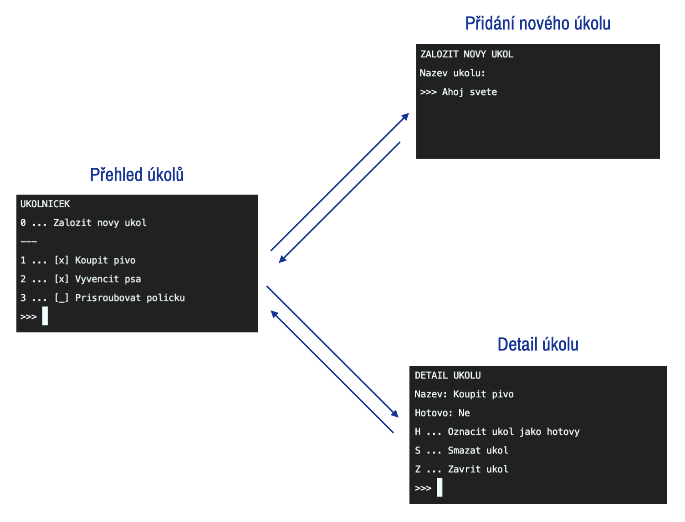

# TypeScript pro Angular - Cvičení 1 - Textový úkolníček

Naším cílem bude naprogramovat si jednoduchý úkolníček s textovým rozhraním, kam půjde:
1. Přidávat úkoly s uživatelsky volitelným názvem,
2. Označovat již přidané úkoly jako hotové,
3. Mazat již přidané úkoly (bez ohledu na jejich stav).

## Dílčí práce k provedení

### 0. Osahejte si prostředí a vyzkoušejte si spuštění prázdné aplikace.
Tento projekt používá nástroj `npm`, což je balíčkový manažer pro správu knihoven, který navíc umí spouštět jednoduché skripty.
* V každém npm projektu se nachází soubor `package.json`, který specifikuje seznam knihoven a skriptů.
    * Knihovny (neboli *závislosti projektu*) naleznete v atributech `dependencies` a `devDependencies`,
    * Skripty naleznete v atributu `scripts`.

Na začátku práce s každým npm projektem je nutno spustit ve složce s projektem příkaz `npm install`.

Po dokončení `npm install` jsou nainstalovány potřebné závislosti a aplikaci lze posléze spustit příkazem `npm start` (spustí skript `start`).

Pokud je vše v pořádku, aplikace by měla vypsat `Hello TypeScript!`.

### 1. Vymodelujte model pro data typu úkol. Každý úkol by měl mít nějaké ID (`id`), nějaký název (`name`) a měl by nést informaci, zda je hotový (`complete`).
* Použijte konstrukt `interface`.

### 2. Vytvořte třídu `TaskStorage`, která bude ukládat, získávat a mazat úkoly.
* Operace:
    * získání všech úkolů,
    * tvorba úkolu,
    * získání úkolu dle ID,
    * smazání úkolu dle ID,
    * nastavení stavu úkolu dle ID.

### 3. Vytvořte za pomoci `console.log`ů a funkce `consolePrompt` jednoduché uživatelské rozhraní.
* Pro implementace jedlitlivých obrazovek rozhraní použijte buď obyčejné funkce nebo konstrukt `class` se `static` metodami.
* Obrazovky:
    * Přehled úkolů v úkolníčku s možností přidání nového úkolu,
    * Obrazovka přidání nového úkolu,
    * Obrazovka detailu úkolu, která by měla umět úkol označit za hotový/rozpracovaný, nebo ho smazat.

V souboru `util.ts` je pro Vaše pohodlí připravena pomocná funkce `consolePrompt`, která implementuje jednoduchý vstup z příkazové řádky.
Funkce je asynchronní, to znamená, že je nutné ji používat společně s klíčovými slovy `await` a `async`.

Obrazovku lze promazat voláním `console.clear()`.

* Inspirace:

